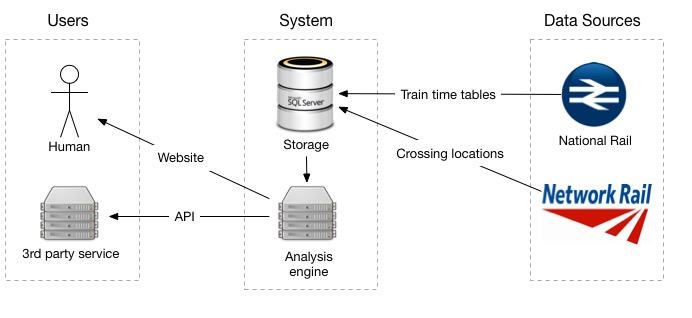

# System Overview

## Data Sources
The project will use 2 data sources.  

- National Rail: will provide the live train location data. This will be stored to predict where the train will be in the future.
- Network Rail: which will provide the level crossing data.

## System
The clever part of the system has two key systems, with other hidden processes which help move data around.

 - Storage: Data will be pulled in from the remote data sources and stored forever
 - Analysis engine: This will use the up to date and historial data in the storage to predict  what the current status of level crossings are now, and times for the future.

## Users
There will be 2 primary users of the system.

- Human: Who will access the site through a web app that works on desktops or mobile.
- 3rd party systems: who will be able to pull the data in from an open api