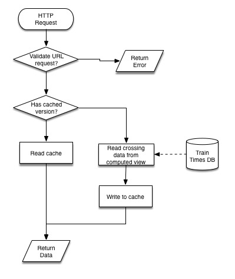

**V 1.3.1**
# Technical Overview

### Purpose
The API is the part that will read the data from the calculated data from the database and return it to the user. The type and data range of the data will be defined in the URL of the request.

### Implementation
#### General
The system will be written in PHP using Lumen as a base framework. This will then be served by the nginx docker container. PHP will receive a HTTP request which will load up the framework, this will then route the request to the correct piece of code based on the router definition. After that a database connection will be made and the code will decide what view it needs to read the data from. Finally it will return the data back to the user in a defined format.

#### Installation and Development
On first setup it is recommended to run `php composer.phar install` inside the Application directory. When developing new routes, add them to the `app/Http/routes.php` file and link them to a controller in `API/app/Http/Controllers/`

#### Errors
The API also defines what should happen if there is a error. If it is a catchable error then it should return an error code along with a message. If its an non catchable error it should return the unknown error code and the PHP error. This is defined further in the API document.

#### Testing
The API code will unit tested using PHPUnit, with a strict 100% code coverage policy. Any automated UA tests and Integrations tests will then be run on commit to the feature branch, Travis CI will be used to run these tests, as well as running PHPunit with code coverage reporting enabled to ensure full coverage. Manual testing will be done and extra unit tests will be written by the reviewer at the stage of code review.

### Flow Chart
##### HTTP Request
The system will start when when a HTTP request is made to the server. The server will then load up PHP and pass the request data long

##### Validate URL request
The next phase is the framework will verify the URL and find the correct piece of code to run it.

##### Has cached version?
Next it checks to see if there's already a cached version of the request. Different requests will have different caching lengths. Stale caches will be automatically removed by the library. (Caching implementation will be deferred until speed becomes an issue, but this is likely to be the end outcome)

##### Read Cache
Assuming is to does have a cached version it needs to read this and pass this on to the returning data phase.

##### Read crossing data from computed view
If the server does not already have the data cached it needs to connect to the database and read the data from a table. No further processing of data needs to be done after this because all of the predicting logic will be done in the database.

##### Write to cache
Once the request has been returned from the database it should be cached for quicker access in the future.

##### Return data
Finally the data should be wrapped correct in the API wrapper and returned to the browser in JSON format.

