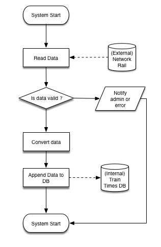

**V 1.0.0**
# Technical Overview

## Implementation
Each importer will be written as a PHP script, this will get the data from the target and import it into the database. Each importer will probably need a set of libraries to access the specific data type.

### Task timing
Each task will need be ran as a cron job. Some tasks will need to be ran every minute others, every mnth depending on how frequent the data changes. This is something that will need to be looked into further.

## Flow Chart
Bellow is the overal flow chart for the connection to the Network Rail data but will be the same for each one changing the data source and the import phase.
##### Start
The script will start and load up several libraries

##### Read Data
Depending on the script it will need to connect to the relevent data source and download the data. This may involve several steps. For instance the network rail CSV link is on a different page, so first that page will need to be gotten so we can then find the location of the CSV to download.

##### Is Data Valid
The data will need to be ran through so kind of test to make sure its valid and looks sain.

##### Notify Admin
If the data is not valid the system admin needs to be notified so someone can investergate. There are multiple reasons why it might not be valid.

###### Convert Data
This step will again varrying depending on the data source but the data will need to be remapping from what ever was collected from the external data source into a format that can be inserted into the data base.

###### Append Data to Data
Now insert the data processed in the previous step into the database.

###### Stystem Stop
Finally the PHP script can stop and PHP will clean up any data handled during the process.

