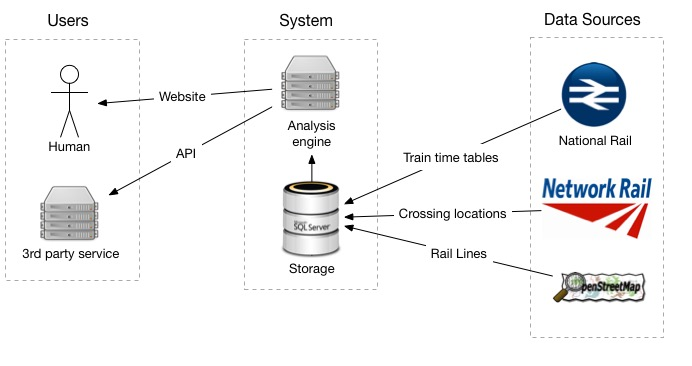

**V 1.2.1**
# Top Level Overview

## Data Sources
The project uses 3 data sources:

- National Rail: provides the live train location data. This is then stored persistantly to predict where the train will be in the future.
- National Rail: provides the locations of rail lines and stations.
- Network Rail: provides the locations, photos, and other attributes of the level crossings.

## System
The clever part of the system has two key systems, with other background processes which help move data around.

 - Storage: Data will be pulled in from the remote data sources and stored forever
 - Analysis engine: This will use the up to date and historial data in the storage to predict  what the current status of level crossings are now, and times for the future.

## Users
There are 2 primary users of the system.

- Human Users: Users who accesses the site through a web app which works on desktops, tablets, and smartphones.
- 3rd Party Systems: who are able to access the raw data from an open, RESTful API.