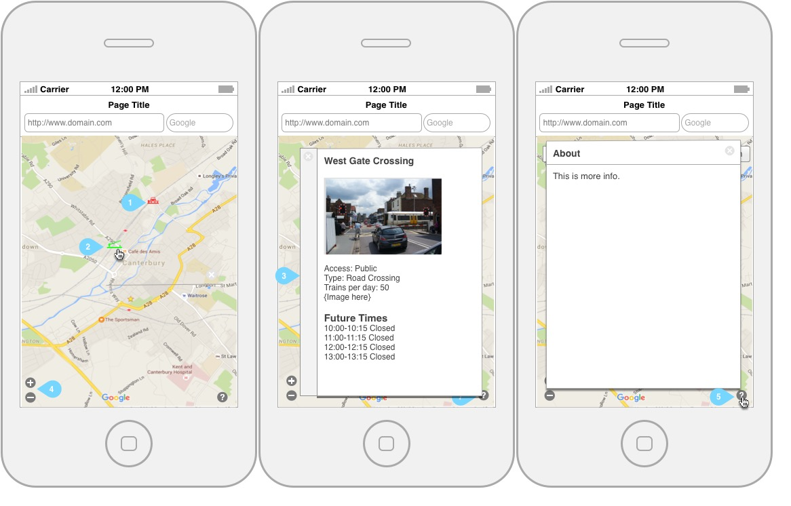

**V 1.1.0**
# UI Designs
### General
The interface will be responsive so it should scale to all screen sizes. Also because of the simplicty of the design, the layout itself wont need to change as it scales.

## Interface testing
After building a mock of the user interface it was tested on a small group of people for usablily as well as private testing it with with different data sets. There where 3 changes to the UI:

- Search bar was removed - Due to the limited area of coverage, no one ever attempted to use this.
- More information bubble was made a model - This provided more room to display data, as the popup provided little space, and even less on smaller devices.
- Go to my current location removed - Google maps does not allow this as standard with their api

The overall UI is slight simplier which is accomplised because we when for a map based view which the user can navigate manaully.

## Interface

### Design V2

1. Closed icon is shown when ever a barrier is down. Using both an icon and colour.
2. Open icon is shown when ever a barrier is up. Using both an icon and colour.
3. When clicking on an crossing it opens a popup which shows the futures open and close times. This includes a small description of the crossing with meta data.
4. The zoom icons provide a way to zoom in and out off the map
5. Clicking the ? icon will open up an about window showing user information about the app.

### Design V1

1. Search bar provides a way to search for any location in the UK and zoom streight to it.
2. Closed icon is shown when ever a barrier is down. Using both an icon and colour.
3. Open icon is shown when ever a barrier is up. Using both an icon and colour.
4. When clicking on an crossing it opens a popup which shows the futures open and close times. This will also include a small description of the crossing with meta data.
5. This is the commonly used ok for focusing on the users current location.
6. The zoom icons provide a way to zoom in and out off the map
7. Clicking the ? icon will open up an about window showing user information about the app.